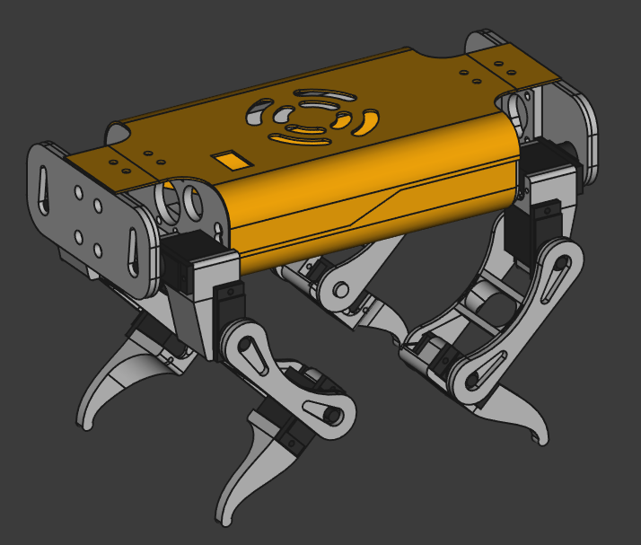

# spotpuppy-models
## Important:
This project was created with FreeCad Link branch, not main branch FreeCad. Usage of FreeCad main branch to open it may cause the files to break.
## About
  \
This is a 3D printable quadruped robot designed for use with a raspberry pi 4. The actuators are MG90s micro servos.
